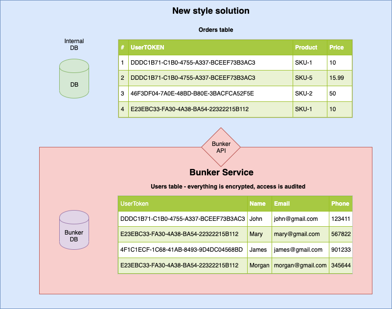
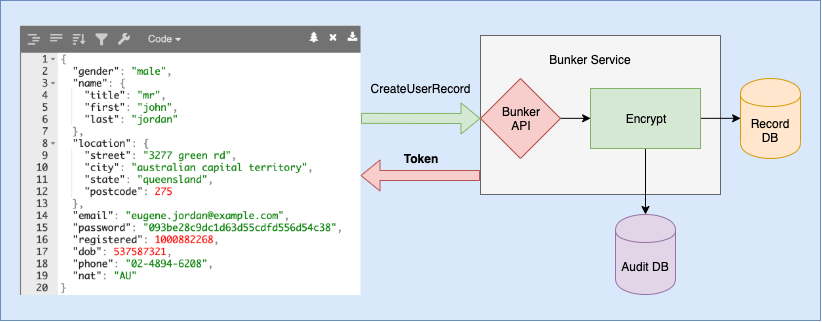
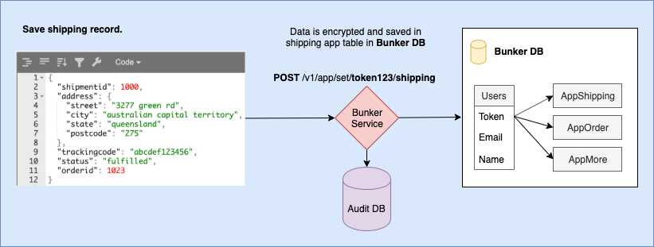
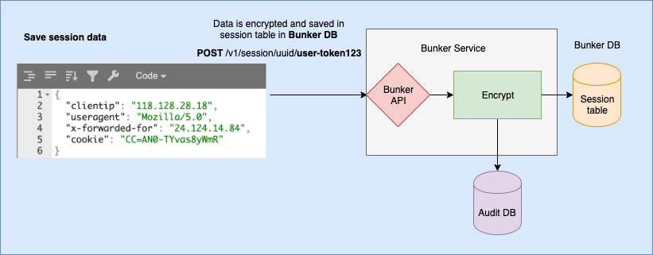

# Paranoid Guy Data Bunker

**Data Bunker is an information tokenization and storage service build to comply with GDPR and CCPA privacy requirements.**

Project **demo** is available at: [https://demo.paranoidguy.com/](https://demo.paranoidguy.com/) . Please add a **star** if you like our project.

We live in a world where our privacy of information is nonexistent, the EU has been working to remediate this fallacy with GDPR, and the US follows with a first sparrow called CCPA.

Data Bunker Project is intended to ease the acceptance of GDPR and CCPA regulations while giving organizations an easy to implement API's, platform and secure Database. This will give all of us, the real data owners, control of our data, and allow us to know who is using our data, what is he doing with it and have the freedom to decide if we agree to that or not.

This project, when deployed correctly, replaces all user personal records (PII) scattered in the organization's different
internal databases and log files with a single user token generated and managed by the Data Bunker service.

By deploying this project and moving all personal information to one place, you will comply with the following
GDPR statement: *Personal data should be processed in a manner that ensures appropriate security and 
confidentiality of the  personal data, including for preventing unauthorized access to or use of personal
data and the equipment used for the processing.*

**NOTE**: Implementing this project does not make you fully compliant with GDPR requirements and you still
need to consult with an attorney specializing in privacy.

#### Diagram of old-style solution.


#### Diagram of Solution with Paranoid Guy Data Bunker


Other documents: [API LIST](API.md), [INSTALLATION](INSTALLATION.md)

## Demo

Project demo is available at: [https://demo.paranoidguy.com/](https://demo.paranoidguy.com/)

You can see management for **Natural person** (**data subject**) account access:

```
Phone: 4444
Code: 4444
```

```
Email: test@paranoidguy.com
Code: 4444
```

---

# This project resolves most of the GDPR requirements for you including:

## Right of access

Data Bunker knows to extract your **customer email** and **customer phone** out of user personal records giving 
**passwordless** access for the customer into their Data bunker' personal account.
This is done by generating a random access key that Data Bunker sends to your customer by email or by SMS.
Your customer login and can view all information collected and saved by Data Bunker in connection to his profile.

<p float="middle">
  
   
  
</p>

## Right to restrict processing / Right to object / Consent withdrawal

Data Bunker manages all user consents. User can **cancel specific consent** in his personal account at Data 
Bunker, for example, to block sending him emails. Your backend can work with Data Bunker using our API to add, or cancel
consents and a callback operation will be fired when a user action takes place.


**NOTE**: Data bunker can call your backend script on consent withdrawal. You need to handle these requests and remove
user records from 3rd party processing companies. For example from web recording services, from email gateways, etc...

## Privacy by design

This product, from the architecture level and up was built to comply with strict privacy laws. Deploying this project will make your architecture 
**privacy by design** compliant.

## Transparency and Accountability principle

Any system or user that connects to Data Bunker must provide an access token to do any operation or the operation will be aborted. A user can login into his profile with a random code we send by email or SMS.

All operations with personal records are **saved in the audit log**.

Your customer can log in to his account at Data Bunker and view the audit trail.


## Right to be forgotten / Right to erasure

When your customer asks for his **right to be forgotten** legal right, his private records will be
wiped out of the Data Bunker database, giving you the possibility to leave all internal databases unchanged.

Upon user removal request, Data bunker can call your backend script with the user details. You need to handle these
requests and remove user records from 3rd party processing companies. For example from web recording services,
from email gateways, etc...


**NOTE**: You just need to make sure that you do not have any user identifiable information in your other databases,
logs, files.

## Right to rectification/ Data Accuracy

Your customer/user can log in to his personal account at Data Bunker and change his records, for example change Name.
Data Bunker can fire a callback operation with a user details, when a user action takes place.


## Right to data portability

Your customer/user can log in to his personal account at Data Bunker and view and extract all his records stored at
Data Bunker.

**NOTE**: You need to provide your customers with a way to extract data from other internal databases.


## Data minimization and GDPR Scope reduction

Basically, when you clean up your databases from personal records and use Data Bunker token instead, you
are already minimizing the personal information you store in different systems. In addition, when sending
you customer data to 3rd party systems Data Bunker provides you with purposely build *shareable identity*
that is time-bound.


## Integrity and confidentiality

All personal data is encrypted. An audit log is written for all operations with personal records.
All-access to Data Bunker API is done using an HTTPS SSL certificate. Enterprise version supports Shamir's Secret Sharing
algorithm to split the master key to a number of keys. A number of keys (that can be saved in different hands in the
organization) are required to bring up the system.


## NOTE

Implementing this project does not make you fully compliant with GDPR requirements and you still need to
consult with an attorney specializing in privacy.

---

# Data Bunker use cases

## Personal information tokenization and storage

User information, or PII, received in HTML POST key/value format of or JSON format is serialized, encrypted
with a 32 byte key and saved in database. You will get a user token to use in internal databases. Afterwords,
you can query the Data Bunker service to receive personal information, saving audit trail.



## Application data separation

When creating application, I suppose you do not want to mix your customer data with data from other applications.
In addition to personal information record, Data Bunker provides you a way to store your app user information in a
specific type of record for that. So, you can retreave only your app' user personal information. For example you
can store user shipping information is additional app table.



## Audit of all operations with personal records

Data Bunker saves audit events on all API operation. For example, new personal record added or changed; personal information
record retreaved, etc...

By providing Audit of events, in relation to personal data, provides response to GDRP Article 15 requirement:
*Right of access by the data subject*.

Special features:

* Personal information in audit event is encrypted.
* User can view his own records only.

Each audit record consists of:

* Date and time
* Operation title
* Operation status
* Operation description
* Change before and after if applicable


## GDPR compliant logging : Web and mobile app session data storage

Web or mobile application session data is very similar. They contain customer IP address, browser information,
web server headers, logged-in user info, etc... Many systems, including popular webservers, like Nginx, Apache
simply store this information in logs. This information, according to GDPR is considered personal identifiable
information and must be secured and controlled.

So, you can not save user ip or browser information in logs now. Insead, Data Bunker will generate you a special token to
save in logs. Data Bunker provides you an API to retreave this info out of Data Bunker without additional password
for a limited time as in GDPR. For example one month.




## Shareable user/app/session identity for 3rd parties

When sharing data with 3rd party services like web analytics, logging, intelligence, etc... sometimes we need to
share user id, for example, customer original IP address or email address. All these pieces of information
are considred user identifiable information and must be minimized when sending to 3rd paty systems.

***Do not share your customer user name, IP, emails, etc... because they look nice in reports!***

According to GDPR: *The personal data should be adequate, relevant and **limited to what is necessary** for the
purposes for which they are processed.*

Our system can generate you time-limited, temporary, shareable identity token that you can share with 3rd
parties as a record identity. This identity, can link back to the user personal record or user app record
or to specific user session.

Optionally, Data Bunker can incorporate partner name in identity so, you track this identity usage.

Your partner can retrieve this information and only specific fields during this specific timeframe.
Afterward, access will be blocked.


## Consent management, i.e. withdawal

According to GDPR, if you want to send your customer SMS using 3rd party gateway,
you must show to your customer a detailed notification message that you will send
his phone number to a specific SMS gateway company and the user needs to confirm this operation.

You need to store these confirmations and Data Bunker can do it for you.

Consent must be freely given, specific, informed and unambiguous. From GDPR, Article 7, item 3:

* **The data subject shall have the right to withdraw his or her consent at any time.**
* **It shall be as easy to withdraw as to give consent.**

In Data Bunker:

* Your customers can log in to his Data Bunker account and view all consents he gave.
* Users can also discharge consents and we will send you a notification message.
* Removing consent for a user is as easy as granting it in the first place.


## Custom application signup and sign-in

When implementing signup and sign-in in your customer-facing applications, we recommend you to
store all signup records in the Data Bunker database. We support 3 types of indexes, index
by login name, index by email address and index by phone number. So you can easily implement
login logic into your solution with our service.

Index by email and index by phone allow us to give your customers passwordless access to their
personal profile at Data Bunker. We send your user a one-time login code by SMS or email to
give them access to thier account at Data Bunker.


---

# Questions

## How do I search for all orders from a guy named John?

Data bunker supports user record lookup by **login name** or **email address** or **phone number** or **token value**.
So, if you have one of these values, you can do the user record lookup (using Data Bunker API) and get user token.
After that you can find user' orders from the **orders table**.

## How to backup Data Bunker database?

We have a special API call for that. You can run the following command to dump database in SQL format:

```
curl -s http://localhost:3000/v1/sys/backup -H "X-Bunker-Token: $TOKEN" -o backup.sql
```

## What about replication?

Replication is supported in **Data Bunker Enterprise version** using the backend **MongoDB database**.
Open source version is using local sqlite3 database that does not supports replication. You can easily backup it
using API call and restore. We decided to use sqlite3 as as it provides zero effort from user to start using
our product.

## Can my DBA tune database performance characteristics?

Almost all Data Bunker requests are using database level indexes when performing API calls.
We would love your DBA to check product database schema for improvements. If we are missing something let us know.
We are using sqlite3 in open source version and MongoDB in enterprive version.

## What is the difference between tokenization solution XXX and Data Bunker?

Most of commercial tokenization solutions are used to tokenize one specific record, for example user name or 
user email, etc... These distinct records are not linked to one user record. In our solution, we tokenize the 
whole user record with all the details, that gives us many additional capabilities. So, in our system, the
**end customer** (**Natural person** or **data subject**) can "login" into his profile, change record or
manage his consents, or ask for **forget me**. In addition we provide many APIs to help with GDPR requirements.

## Why Open Source?

We are a big fan of the open-source movement. After a lot of thoughts and consultations,
the main Data Bunker product will be open source.

We are doing this to boost the adoption of a **privacy enabled world**.

Enterprise version will be closed source.

## What is considered PII or what information is recomended to store in Data Bunker?

Following is a partial list.

| PII                           | PII                       |
| ----------------------------- | ------------------------- |
| * Name                        | * RFID                    |
| * Address                     | * Contacts                |
| * IP address                  | * Genetic info            |
| * Cookie data                 | * Passport data           |
| * Banking info                | * Driving license         |
| * Financial data              | * Mobile device ID        |
| * Browsing history            | * Personal ID number      |
| * Political opinion           | * Ethnic information      |
| * Sexual orientation          | * Health / medical data   |
| * Social Security Number      | * Etc...                  |


# Technology stack?

We use golang/go to build the whole project. Open source version comes with internal
database (**sqlite3**) and Web UI as one executable file to make the project easy to deploy.

## Encryption in motion and encryption in storage

All access to Data Bunker API is done using HTTPS SSL certificate. All records that have user personal information
are encrypted or securely hashed in the databases. All user records are encrypted with a 32 byte key comprizing of
**System Master key** (24 bytes, stored in memory, not on disk) and **user record key** (8 bytes, stored on disk).
The **System Master key** is kept in RAM and is never stored to disk. Enterprise version supports **Master key split**. 

## Data Bunker internal tables

Information inside Data Bunker is saved in multiple tables in encrypted format. Here is a diagram of tables.

Detailed use case for each table is covered bellow.


---

# Enterprise features (not an open source version)

## Support for Mongo backend

The Databunker open source works with a local database, while enterprise version works with MongoDB database.
With MongoDB you can spin a number of database replicas using [MongoDB Atlas services](https://www.mongodb.com/cloud/atlas)
and Databunker enterprise version will connect with this database cluster.

## Master key split

Upon initial start, the **Enterprise version** generates a secret master key and 5 keys out of it.
These 5 keys are generated using Shamir's Secret Sharing algorithm. Combining 3 of any of the keys,
ejects original master key and that can be used to decrypt all records.

The Master key is kept in RAM and is never stored to disk. You will need to provide 3 kits to unlock the application.
It is possible to save these keys in the AWS secret store and other vault services.

## Advanced role management, ACL

By default, all access to Data Bunker is done with one root token or with **Time-limited access tokens**
that allow to read data from specific user record only.

For more granular control, Data Bunker supports the notion of custom roles. For example, you can create a role
to view all records or another role to add and change any user records; view sessions, view all audit events, etc...

After you define a role, the system allow you to generate access token for this role (you will need to have root token
for all these operations).

Data Bunker have an API for all these operations.

## Support Hashicorp Vault

Hashicorp Vault, is a great piece of new generation of security product, has a notion of session accounts/passwords.
Hashicorp Vault can store root access token to Paranoid Guy Data Bunker, and when your application wants to open
session and access Data Bunker, it will talk with Bunker to issue a temp token with specified role.
When your application session is closed with Data Bunker, Hashicorp Vault will connect to Data Bunker and revoke access token.

This architecture is done to minimize the chance that if the attacker breakes into your application server,
he will not get a full controll over the Data Bunker service as root token will not be saved in your
application server.

This is all done with the help of custom plugin we build for Hashicorp Vault.

# Contact us

For technical questions or for product demo you can talk with Yuli Stremovsky at stremovsky@gmail.com

For business inquiries, partnership requests you can talk with Boaz Shunami at boaz@komodosec.com

---

Other documents: [API LIST](API.md), [INSTALLATION](INSTALLATION.md)
